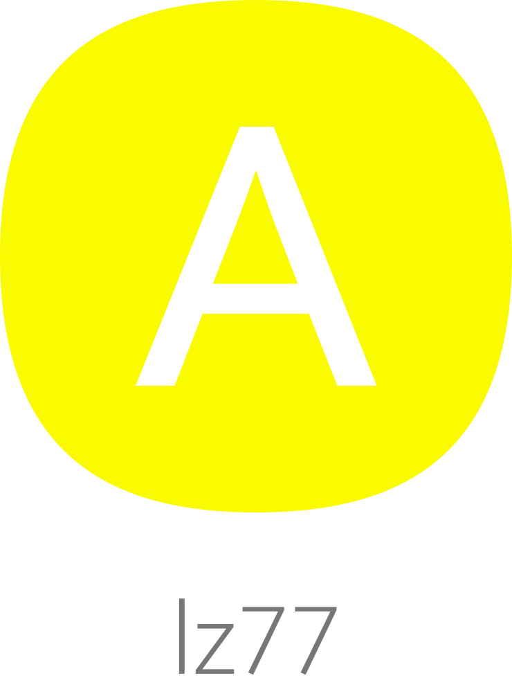

</br >
</br >

<p align='center'>
  <a target='_blank' rel='noopener noreferrer' href='#'>
    
  </a>
</p>

<h1 align='center'>AMAUI LZ77</h1>

<p align='center'>
  Own implementation of LZ77, Abraham Lempel and Jacob Ziv's loseless data compression algorithm
</p>

<br />

<h3 align='center'>
  <sub>MIT license&nbsp;&nbsp;&nbsp;&nbsp;</sub>
  <sub>Production ready&nbsp;&nbsp;&nbsp;&nbsp;</sub>
  <sub>UMD 7kb gzipped&nbsp;&nbsp;&nbsp;&nbsp;</sub>
  <sub>100% test cov&nbsp;&nbsp;&nbsp;&nbsp;</sub>
  <sub>Browser and Nodejs</sub>
</h3>

<p align='center'>
    <sub>Very simple code&nbsp;&nbsp;&nbsp;&nbsp;</sub>
    <sub>Modern code&nbsp;&nbsp;&nbsp;&nbsp;</sub>
    <sub>Junior friendly&nbsp;&nbsp;&nbsp;&nbsp;</sub>
    <sub>Typescript&nbsp;&nbsp;&nbsp;&nbsp;</sub>
    <sub>Made with :yellow_heart:</sub>
</p>

<br />

## Getting started

### Add

```sh
  // yarn
  yarn add @amaui/lz77

  // npm
  npm install @amaui/lz77
```

### Use

```javascript
  import AmauiLZ77 from '@amaui/lz77';

  // Make a new lz77 instance with a value
  const amauiLZ77 = new AmauiLZ77('Lorem u ipsum dolor sit amet amet amet amet amet amet amet, consectetur adipiscing elit. Proin egestas mauris elit, sit amet molestie nisi semper at. Cras interdum massa nec molestie rutrum. Duis commodo venenatis justo, ac porta tellus pellentesque sed. Donec et nisi aumus. Proin egestas mauris elit, sit amet molestie nisi semper at. Cras interdum massa nec molestie rutrum. Duis commodo venenatis justo, ac porta tellus pellentesque sed. Donec et nisi aumus. Proin egestas mauris elit, sit amet molestie nisi semper at. Cras interdum massa nec molestie rutrum. Duis commodo venenatis justo, ac porta tellus pellentesque sed. Donec et nisi aumus. Proin egestas mauris elit, sit amet molestie nisi semper at. Cras interdum massa nec molestie rutrum. Duis commodo venenatis justo, ac porta tellus pellentesque sed. Donec et nisi aumus.');

  // Encoded
  // or very simply amauiLZ77.response
  const response = amauiLZ77.encoded;

  // {
  //     value: ' Lorem u ipsum dolor sit ame`5,v`, consectetur adipiscing elit. Proin egestas mauris elit,`2o,a`molestie nisi semper at. Cras interdum massa nec `1d,9`rutrum. Duis commodo venenatis justo, ac porta tellus pellentesque sed. Donec et nisi aumus.`57,fl`',
  //     original_byte_size: 836,
  //     value_byte_size: 250,
  //     compression_ratio: 3.34,
  //     compression_percentage: 70.1,
  //     positive: true,
  //     encode_execution_milliseconds: 4,
  //     encode_execution: '4 milliseconds'
  // }

  // Decode
  // with amauiLZ77.decode or AmauiLZ77.decode a static method
  AmauiLZ77.decode(response.value);

  // {
  //     value: 'Lorem u ipsum dolor sit amet amet amet amet amet amet amet, consectetur adipiscing elit. Proin egestas mauris elit, sit amet molestie nisi semper at. Cras interdum massa nec molestie rutrum. Duis commodo venenatis justo, ac porta tellus pellentesque sed. Donec et nisi aumus. Proin egestas mauris elit, sit amet molestie nisi semper at. Cras interdum massa nec molestie rutrum. Duis commodo venenatis justo, ac porta tellus pellentesque sed. Donec et nisi aumus. Proin egestas mauris elit, sit amet molestie nisi semper at. Cras interdum massa nec molestie rutrum. Duis commodo venenatis justo, ac porta tellus pellentesque sed. Donec et nisi aumus. Proin egestas mauris elit, sit amet molestie nisi semper at. Cras interdum massa nec molestie rutrum. Duis commodo venenatis justo, ac porta tellus pellentesque sed. Donec et nisi aumus.',
  //     original_byte_size: 250,
  //     value_byte_size: 836,
  //     encode_execution_milliseconds: 0,
  //     encode_execution: '0 milliseconds'
  // }
```

### Dev

Install

```sh
  yarn
```

Test

```sh
  yarn test
```

### Prod

Build

```sh
  yarn build
```

### Docs

Might be soon...
